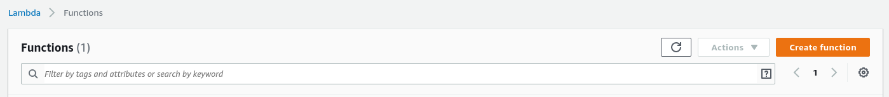
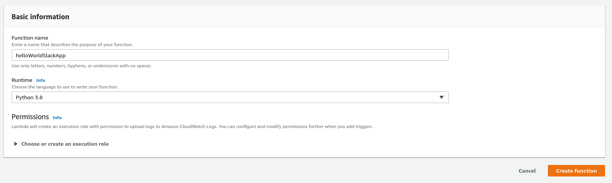

Minimalistic Serverless Slack App
===

This is a minimalistic (single-file, no dependencies, 120 lines of code) AWS Lambda function to create a Slack App.

It was created in June 2020.

Project goals
---

- Provide a starting point for slack apps.
- Show a bare-bones implementation of a Slack App on Lambda. Many tutorials include tons of dependencies which make it really hard to figure out what is really going on. Besides, you have to struggle with uploading dependencies to Lambda, which will include tooling, which brings in even more complexity.

Technologies used
---

- AWS API Gateway
- AWS Lambda
- Python 3.8
- Slack App

Design goals
---

- Simplicity (single file, no Layers in Lambda, no dependencies)
- Cheap to run, it should only cost a couple of cents per month
- Secure
- Cloud-only. You can not run this program locally. No Flask, no Gunicorn, no WSGI etc. Just a plain Lambda handler.

Included functionality
---

- a Slack command `/test` that replies `Hello, World!`.

You should later extend this with more commands.

Setting it up
===

Setting this all up should take about 10 minutes, but I challenge you to do a speed run.

To get started, you'll need to follow these steps.

1. Create a Slack App
2. Create a Lambda Function and API Gateway
3. Configure the Slack App to use the API Gateway

Here we go!

Step 1 - Create a Slack App
---

Go to https://api.slack.com/apps

Click `Create New App`.

We'll continue to set up a new `Slash Command`.

Now this opens

Unfortunately, we can't set the Request URL yet, because we don't have an endpoint yet. We'll NOT create a slash command yet, we'll create an endpoint in step 2 and come back to this screen in step 3. I just wanted to show you where we're going with this.

For now, go back to `Basic Information` and copy your `Signing Secret`. You'll need that for the Lambda Function. Don't worry, the signing secret of this app has been regenerated already, it's not a security leak ;)

Step 2 - Create a Lambda Function and API Gateway
---

You should log in to AWS with an account that allows you to set up and API Gateway and a Lambda function.

Go to the Lambda console, and click `Create Function`.

Enter the details below and click `Create Function` again.

It's created! On the function details screen, click `Add Trigger`.

Continue to create an API Gateway with the following settings:

Now copy the Python code from this repository into the Function Code below and hit "Save".

Scroll down to "Environment Variables" and click "Manage Environment Variables". Create an environment variable with the slack signing secret from Step 1.

The function and API gateway should now be live!

Go ahead and copy the `API endpoint` of your API Gateway. We'll configure this in the Slash Command in Step 3. The value should be something like this: `https://qrsxptbav8.execute-api.eu-west-1.amazonaws.com/default/helloWorldSlackApp`

Step 3 - Configure the Slack App to use the API Gateway
---

Go back to the Slack App and create a new Slash Command. Use the API endpoint from Step 2 for the Request URL.

Now install the App in your workspace.

In your workspace you should now be able to type `/test` and see the following:

That was all! Great success!
